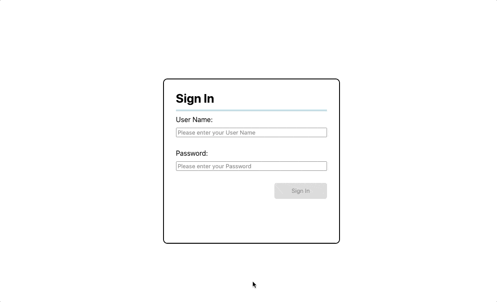
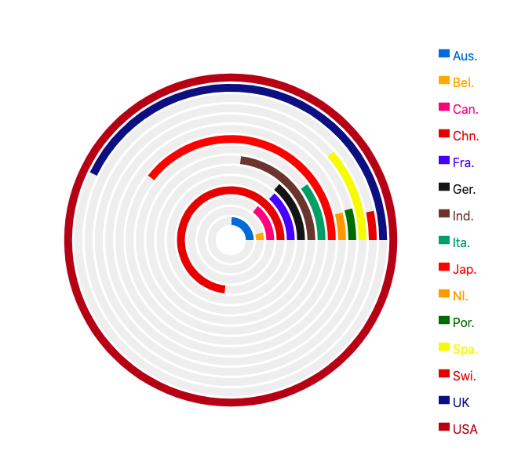
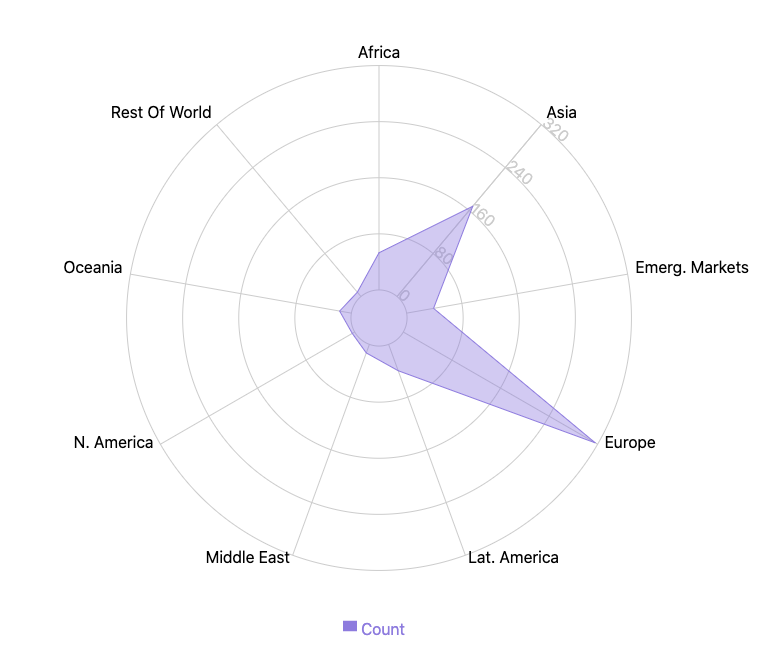
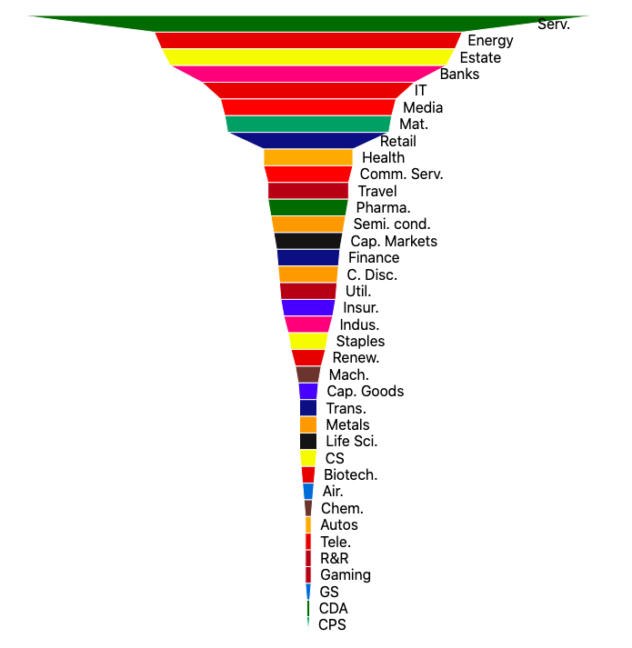

# graph-visual-test 📊
A project to test unconventional ways to visually present data

## Table of Contents 📖

- [Overview](#overview-)
- [Technologies](#technologies-)
- [Planning](#process-)
- [Wins](#wins-)
- [Getting Started](#getting-started-)

## Overview 👓

A simple, **web application** that takes **arbitrary login details** and allows the user to **choose** a **set of data** that is **visually represented** with a **graph**. Each set of data has been portrayed with an **'out of the ordinary' graph**.

The data has been provided as part of a **coding task** to visualise the representation of **investment related key words**.

## Technologies 💻

- General:
    - **HTML5**
    - **CSS3**
    - **Sass**
    - **React**
- Others:
    - **GitHub**
- 3rd party packages:
    - **Rechart**

## Process 📝
- I started by **building** the **basic Front-End components** i.e. **'Log-In', 'Choice Buttons'**

- For the **'Log-In' component**, I also added a functionality to **disable** the **'Sign in' button** should there be **no inputs** for the **'Username'** and **'Password'** fields. This acts as a **basic form validation**

- Next, I **hard-coded** the **data** that was **provided** to me before **test building** a **basic graph**

- Finally, I **chose 3 different graphs** that are **unique/unconventional** yet still accurately presents the data

### MVP
- **GitHub repository** containing **project code**
- **Readme document** containing **thought processes** and **any assumptions made**
- A **simple**, **web application** which takes a **'username' and 'password'**, upon **successful log in**, user can see **data represented** on a **graph**

## Wins 🏆

The biggest win in this project was learning to use 3 new, unconventional (**Radial Bar Chart, Funnel Chart, Radar Chart**) but very powerful visual forms of data representations.

In the process, further **building** on my **existing knowledge** of the '**Recharts' library** and adding **additional forms of data representation** to my toolkit.

## Getting Started 🏃‍♂️🏃‍♀️

If you wish to **run it locally**, you will need to **follow the steps below**:

- **Fork** or **Clone** the **GitHub repository** ([https://github.com/tams2429/graph-visual-test](https://github.com/tams2429/graph-visual-test)),
- In the root project folder, run `npm install` to **install** all **dependencies**,
- `npm start` to **start the development server** for the **whole application**,
